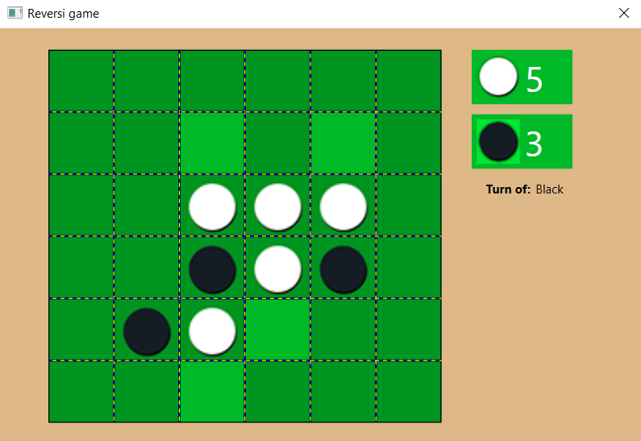
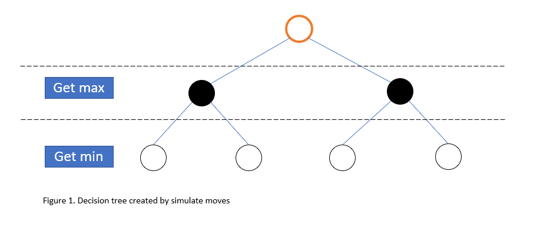
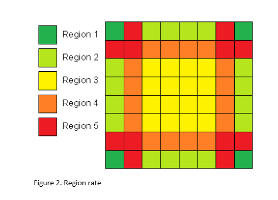

# Reversi
The Reversi game project is built with C# and WPF. There is a separation between the game logic and the user interface, the logic is in a separate assembly. The project has an AI algorithm for playing against the computer.

## AI Algorithem:
In the AI algorithm there is an implementation of a MinMax algorithm.

In addition the board is divided into different regions so that each region has a different rating 
that influences the decision on the next move

### MinMax algorithm

The Minimax algorithm looks multiple moves ahead while maximizing the AI's score and minimizing the human player's score.

This is a recursive algorithm that repeatedly play moves and calculate scores. we simulate all possible moves of the first player and simulate the possible moves of the second player in response. The algorithm searches for the minimum score during the second player's simulated responses, and the maximum scores during its own simulated moves. In this way we discover which moves will lead to the best result in subsequent moves.

### Regions rate

In addition to the algorithm mentioned above, we add to the calculation of the points the risk level of each move. It can be seen that there are dangerous areas, which we would like to avoid. For example a move in the corners of the game is excellent because it can not be surrounded by another slot. On the other hand, a move that is adjacent to a corner is dangerous because it will allow the opponent to use the corner. The following diagram describes the risk of each area (Red - dangerous, Green - good).

